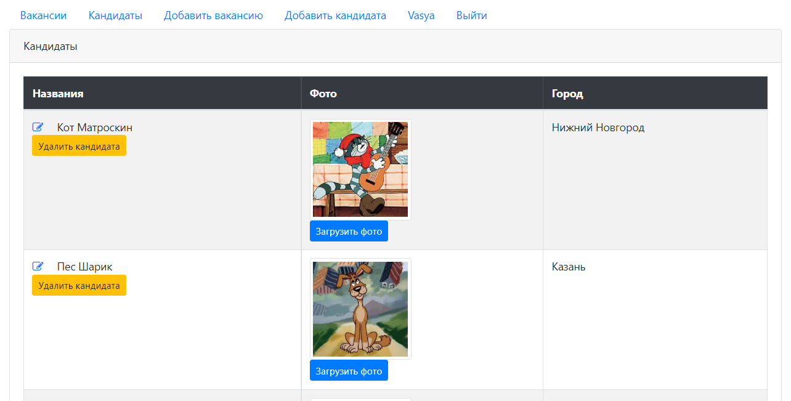
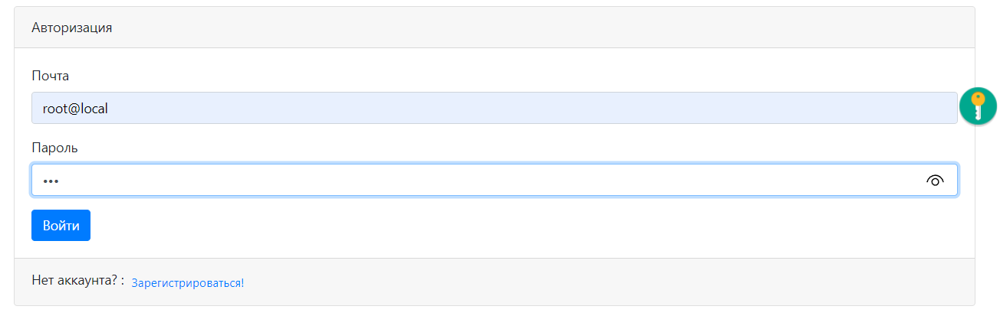
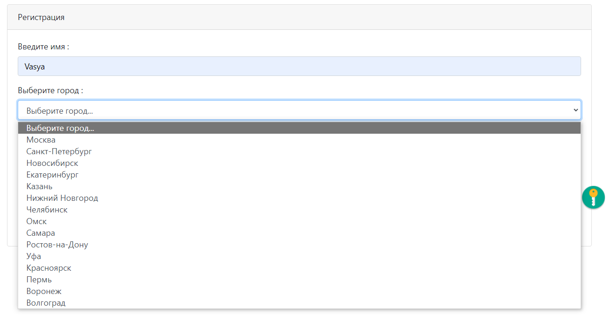

# job4j_dreamjob
This application demonstrates basic CRUD application for job searching.

Functionality:
* CRUD operations
* Auth/Auth

Technologies:
* Servlets
* JSP
* Simple HTML/JS(Jquery|Ajax)/CSS
* JDBC
